# Meepo Architecture

## Overview

Meepo is a 7-crate Rust workspace implementing a local AI agent for macOS and Windows. It runs an autonomous observe/think/act loop, connects Claude to messaging channels (Discord, Slack, iMessage, email), gives it access to 75+ tools (email, calendar, reminders, notes, browser automation, web search, code, music, contacts, lifestyle integrations, and more), maintains a persistent knowledge graph, and speaks both MCP and A2A protocols for multi-agent interop.

## Crate Dependency Graph

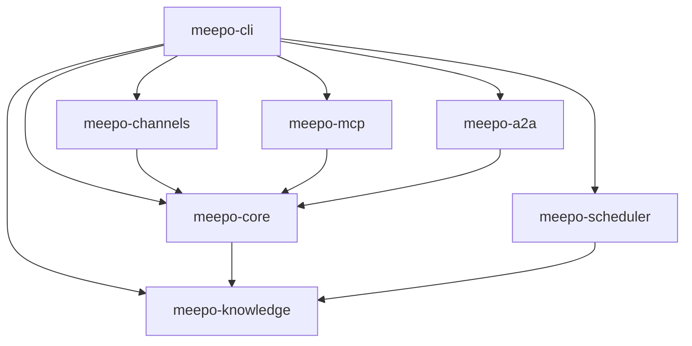

| Crate | Purpose | Key Types |
|-------|---------|-----------|
| `meepo-cli` | Binary entry point, config, subcommands, template system | `Cli`, `MeepoConfig`, `Template` |
| `meepo-core` | Agent loop, API client, tool system, orchestrator, autonomy, platform abstraction, skills, notifications | `Agent`, `ApiClient`, `ToolRegistry`, `TaskOrchestrator`, `AutonomousLoop`, `NotificationService`, `TavilyClient` |
| `meepo-channels` | Channel adapters and message routing | `MessageBus`, `MessageChannel` |
| `meepo-knowledge` | SQLite + Tantivy persistence | `KnowledgeDb`, `KnowledgeGraph`, `TantivyIndex` |
| `meepo-scheduler` | Watcher runner and event system | `WatcherRunner`, `Watcher`, `WatcherEvent` |
| `meepo-mcp` | MCP server (STDIO) and client for external MCP servers | `McpServer`, `McpClient`, `McpToolAdapter` |
| `meepo-a2a` | A2A (Agent-to-Agent) protocol server and client | `A2aServer`, `A2aClient`, `AgentCard`, `DelegateToAgentTool` |

## Message Flow

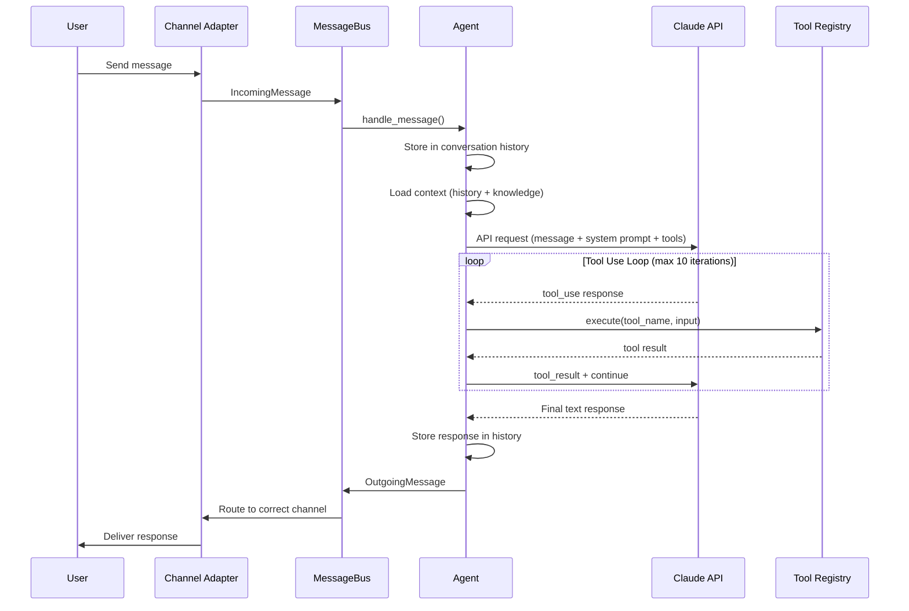

## System Architecture

```mermaid
graph TB
    subgraph CLI["meepo-cli (Binary)"]
        Config[Config Loader]
        Init[Init Command]
        Start[Start Command]
        Ask[Ask Command]
        McpCmd[MCP Server Command]
        TplCmd[Template Commands]
    end

    subgraph Core["meepo-core"]
        Agent[Agent]
        API[ApiClient]
        ToolReg[ToolRegistry]
        AutoLoop[AutonomousLoop]
        Notifier[NotificationService]
        Platform[Platform Abstraction]
        Skills[Skill Loader]

        subgraph ToolSystem["Tools (40+)"]
            MacOS[Email/Calendar/Reminders/Notes/Contacts/Music]
            A11y[Accessibility Tools]
            Browser[Browser Automation]
            Code[Code Tools]
            Web[Web Search + Browse]
            Mem[Memory Tools]
            Sys[System + Filesystem]
            Watch[Watcher Tools]
            Auto[Autonomous Tools]
            Deleg[Delegation]
        end

        Orch[TaskOrchestrator]
        Tavily[TavilyClient]
    end

    subgraph Channels["meepo-channels"]
        Bus[MessageBus]
        BusSender[BusSender]
        Discord[DiscordChannel]
        Slack[SlackChannel]
        IMsg[IMessageChannel]
        Email[EmailChannel]
    end

    subgraph Knowledge["meepo-knowledge"]
        DB[(SQLite)]
        Tantivy[(Tantivy Index)]
        Graph[KnowledgeGraph]
        MemSync[Memory Sync]
    end

    subgraph Scheduler["meepo-scheduler"]
        Runner[WatcherRunner]
        Persist[Persistence]
        Watchers["Watchers (7 types)"]
    end

    subgraph MCP["meepo-mcp"]
        McpServer[McpServer STDIO]
        McpClient[McpClient]
        McpAdapter[McpToolAdapter]
    end

    subgraph A2A["meepo-a2a"]
        A2aServer[A2aServer HTTP]
        A2aClient[A2aClient]
        AgentCard[AgentCard]
    end

    Start --> AutoLoop
    AutoLoop --> Agent
    Start --> Bus
    Start --> Runner
    Ask --> API
    McpCmd --> McpServer

    Agent --> API
    Agent --> ToolReg
    ToolReg --> ToolSystem
    AutoLoop --> Notifier
    MacOS --> Platform

    Bus --> Discord
    Bus --> Slack
    Bus --> IMsg
    Bus --> Email
    Bus --> BusSender

    Mem --> Graph
    Graph --> DB
    Graph --> Tantivy
    MemSync --> DB

    Runner --> Watchers
    Runner --> Persist
    Persist --> DB

    Deleg --> Orch
    Orch --> API
    Web --> Tavily
    Tavily -->|HTTP| TavilyAPI[Tavily API]

    McpServer --> McpAdapter
    McpAdapter --> ToolReg
    McpClient -->|STDIO| ExtMCP[External MCP Servers]

    A2aServer --> Agent
    A2aClient -->|HTTP| PeerAgent[Peer Agents]

    Platform -->|AppleScript| Mail[Mail.app]
    Platform -->|AppleScript| Cal[Calendar.app]
    Platform -->|AppleScript| Reminders[Reminders.app]
    Platform -->|AppleScript| Notes[Notes.app]
    Platform -->|AppleScript| SafariBrowser[Safari/Chrome]
    IMsg -->|SQLite| MsgDB[Messages DB]
    IMsg -->|AppleScript| MsgApp[Messages.app]
    Discord -->|WebSocket| DiscordAPI[Discord API]
    Slack -->|HTTP Polling| SlackAPI[Slack Web API]
```

## Event Loop

The main event loop runs in `cmd_start()` using `tokio::select!` across four sources:

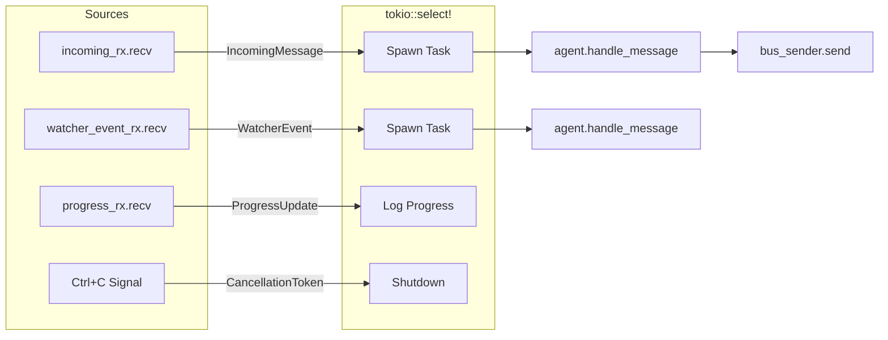

The bus is split into a receiver (`mpsc::Receiver<IncomingMessage>`) and an `Arc<BusSender>` to allow concurrent send/receive without borrow conflicts.

## Tool System

Tools implement the `ToolHandler` trait and are registered in a `ToolRegistry` (HashMap-backed). The agent's API client runs a tool loop that executes tools until Claude returns a final text response or hits the 10-iteration limit.

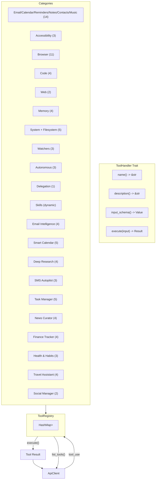

### Tool List

| Tool | Description | Implementation |
|------|-------------|----------------|
| `read_emails` | Read recent emails | Platform provider (AppleScript / PowerShell COM) |
| `send_email` | Send email | Platform provider (sanitized input) |
| `read_calendar` | Read upcoming calendar events | Platform provider |
| `create_calendar_event` | Create calendar event | Platform provider |
| `list_reminders` | List reminders from Reminders.app | AppleScript (macOS only) |
| `create_reminder` | Create a reminder | AppleScript (macOS only) |
| `list_notes` | List notes from Notes.app | AppleScript (macOS only) |
| `create_note` | Create a note | AppleScript (macOS only) |
| `search_contacts` | Search contacts by name | AppleScript (macOS only) |
| `get_current_track` | Get currently playing track | AppleScript (macOS only) |
| `music_control` | Play/pause/skip music | AppleScript (macOS only) |
| `open_app` | Open application by name | `open -a` / `open` crate |
| `get_clipboard` | Read clipboard contents | `arboard` crate (cross-platform) |
| `send_notification` | Send system notification | AppleScript (macOS only) |
| `screen_capture` | Capture screenshot | `screencapture` CLI (macOS only) |
| `read_screen` | Read focused app/window info | Platform UI automation |
| `click_element` | Click UI element by name | Platform UI automation |
| `type_text` | Type text into focused app | Platform UI automation |
| `browser_list_tabs` | List all open browser tabs | AppleScript (Safari/Chrome) |
| `browser_open_tab` | Open a new tab with URL | AppleScript |
| `browser_close_tab` | Close a tab by ID | AppleScript |
| `browser_switch_tab` | Switch to a tab by ID | AppleScript |
| `browser_get_page_content` | Get page text/HTML content | AppleScript + JS |
| `browser_execute_js` | Execute JavaScript in tab | AppleScript |
| `browser_click` | Click element by CSS selector | AppleScript + JS |
| `browser_fill_form` | Fill form field by selector | AppleScript + JS |
| `browser_navigate` | Navigate (back/forward/reload) | AppleScript |
| `browser_get_url` | Get current page URL | AppleScript |
| `browser_screenshot` | Screenshot current page | AppleScript |
| `write_code` | Delegate coding to Claude CLI | `claude` CLI subprocess |
| `make_pr` | Create GitHub pull request | `git` + `gh` CLI |
| `review_pr` | Analyze PR diff for issues | `gh pr view` + diff analysis |
| `spawn_claude_code` | Spawn background Claude Code task | `claude` CLI (async, `--dangerously-skip-permissions`) |
| `web_search` | Search the web via Tavily | Tavily Search API (conditional) |
| `browse_url` | Fetch URL content | Tavily Extract → raw `reqwest` fallback |
| `remember` | Store entity in knowledge graph | SQLite + Tantivy insert |
| `recall` | Search entities by name/type | SQLite query |
| `search_knowledge` | Full-text search knowledge graph | Tantivy search |
| `link_entities` | Create relationship between entities | SQLite insert |
| `smart_recall` | GraphRAG-powered knowledge retrieval | Tantivy search + graph traversal |
| `ingest_document` | Chunk and index a document | Recursive splitting + SQLite/Tantivy |
| `run_command` | Execute shell command (allowlisted) | `sh -c` with 30s timeout |
| `read_file` | Read file contents | `tokio::fs::read_to_string` |
| `write_file` | Write file contents | `tokio::fs::write` |
| `list_directory` | List files in a directory | `std::fs::read_dir` (sandboxed) |
| `search_files` | Search file contents by pattern | Recursive grep (sandboxed) |
| `create_watcher` | Create a background monitor | SQLite + tokio task |
| `list_watchers` | List active watchers | SQLite query |
| `cancel_watcher` | Cancel an active watcher | CancellationToken |
| `spawn_background_task` | Spawn autonomous background sub-agent | Database + mpsc command |
| `agent_status` | Show active watchers, tasks, recent results | SQLite queries |
| `stop_task` | Cancel any watcher or background task by ID | CancellationToken + database |
| `delegate_tasks` | Spawn sub-agent tasks (parallel/background) | TaskOrchestrator |
| `email_triage` | Categorize and prioritize recent emails | Platform email provider + knowledge graph |
| `email_draft_reply` | Draft contextual email replies | Platform email provider + knowledge graph |
| `email_summarize_thread` | Summarize an email thread | Platform email provider |
| `email_unsubscribe` | Find unsubscribe links in emails | Platform email provider |
| `find_free_time` | Find available time slots in calendar | Platform calendar provider |
| `schedule_meeting` | Schedule a meeting with attendees | Platform calendar + contacts + email |
| `reschedule_event` | Reschedule an existing calendar event | Platform calendar provider |
| `daily_briefing` | Generate today's schedule briefing | Platform calendar + knowledge graph |
| `weekly_review` | Generate weekly review with upcoming events | Platform calendar + action log |
| `research_topic` | Multi-query deep research on a topic | Tavily search + knowledge graph |
| `compile_report` | Compile research into a structured report | Knowledge graph entities |
| `track_topic` | Track a topic for ongoing monitoring | Knowledge graph |
| `fact_check` | Verify a claim against web sources | Tavily search + knowledge graph |
| `send_sms` | Send SMS/iMessage via Messages.app | AppleScript (macOS) + knowledge graph |
| `set_auto_reply` | Set auto-reply rules for messages | Knowledge graph preferences |
| `message_summary` | Summarize recent message conversations | Knowledge graph conversations |
| `create_task` | Create a task with priority and project | Knowledge graph |
| `list_tasks` | List tasks with filtering options | Knowledge graph query |
| `update_task` | Update task status, priority, or details | Knowledge graph |
| `complete_task` | Mark a task as completed | Knowledge graph |
| `project_status` | Get project overview with task breakdown | Knowledge graph aggregation |
| `track_feed` | Subscribe to a news/content feed | Knowledge graph |
| `untrack_feed` | Unsubscribe from a tracked feed | Knowledge graph |
| `summarize_article` | Summarize an article from URL | Tavily extract + knowledge graph |
| `content_digest` | Generate digest of tracked feeds | Tavily search + knowledge graph |
| `log_expense` | Log an expense with category and vendor | Knowledge graph |
| `spending_summary` | Get spending summary for a period | Knowledge graph aggregation |
| `budget_check` | Check spending against budget limits | Knowledge graph |
| `parse_receipt` | Extract expense data from receipt text | Structured extraction prompt |
| `log_habit` | Log a habit entry with value and date | Knowledge graph + streak calculation |
| `habit_streak` | Get streak info for habits | Knowledge graph query |
| `habit_report` | Generate comprehensive habit report | Knowledge graph aggregation |
| `get_weather` | Get weather forecast for a location | Tavily search |
| `get_directions` | Get directions between locations | Tavily search |
| `flight_status` | Check flight status by flight number | Tavily search + knowledge graph |
| `packing_list` | Generate smart packing list for a trip | Knowledge graph |
| `relationship_summary` | Get relationship overview for contacts | Knowledge graph + conversations |
| `suggest_followups` | Suggest people to follow up with | Knowledge graph + conversations |

## Knowledge Graph

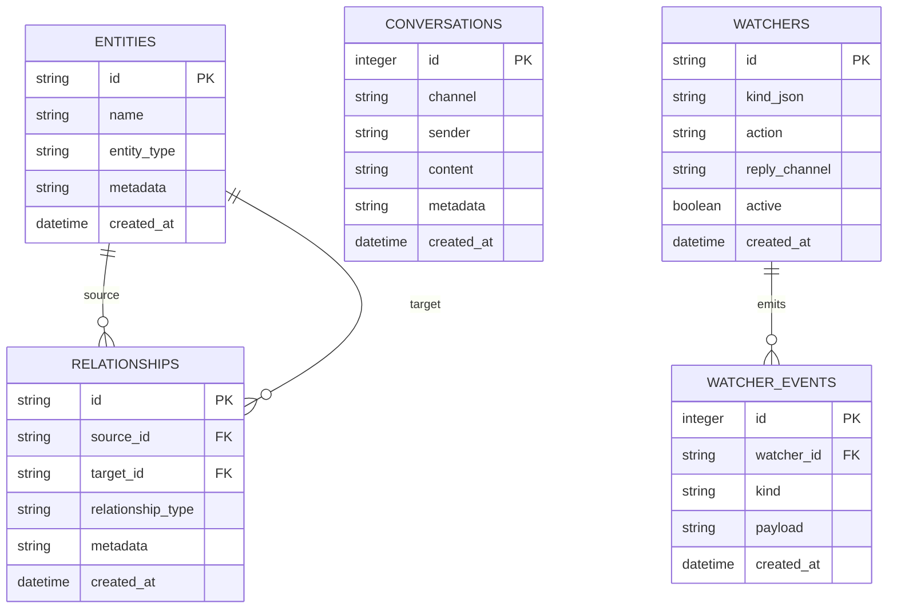

The knowledge layer has two backends:
- **SQLite** (`KnowledgeDb`) — Stores entities, relationships, conversations, and watchers with indexed queries
- **Tantivy** (`TantivyIndex`) — Full-text search index over entity content, returning relevance-ranked results

`KnowledgeGraph` combines both, indexing entities in Tantivy on insert and delegating searches to the appropriate backend.

## RAG Features

The agent integrates 8 retrieval-augmented generation features inspired by LangChain v1 and recent RAG research (2024–2025). All are configurable via `config/default.toml` under the `[rag.*]` sections.

### Agent Loop Integration

```
User Query
  │
  ├─ 1. Adaptive Query Routing    (query_router.rs)   — classify complexity → retrieval strategy
  ├─ 2. Context Loading
  │     ├─ Conversation Summarization (summarization.rs) — compress old history, keep recent verbatim
  │     ├─ Knowledge Search           (Tantivy BM25)
  │     └─ GraphRAG Expansion         (graph_rag.rs)     — traverse relationships for richer context
  ├─ 3. Tool Selection             (tool_selector.rs)  — heuristic + optional LLM to pick relevant tools
  ├─ 4. Claude API Call            (api.rs tool loop)
  │     └─ Middleware Chain         (middleware.rs)     — before_model / after_model / before_tool / after_tool hooks
  └─ 5. Corrective RAG            (corrective_rag.rs) — validate retrieval relevance, refine query if needed
```

| Feature | Module | Default | Description |
|---------|--------|---------|-------------|
| Conversation Summarization | `meepo-core/summarization.rs` | Enabled | Summarizes older conversation history when context exceeds threshold (60k chars). Keeps recent 10 messages verbatim. |
| Vector Embeddings + Hybrid Search | `meepo-knowledge/embeddings.rs` | Disabled | Local ONNX embedding generation via `fastembed-rs`. Hybrid search combines BM25 + cosine similarity with Reciprocal Rank Fusion. |
| GraphRAG | `meepo-knowledge/graph_rag.rs` | Enabled | Expands search results by traversing entity relationships (up to 2 hops). Scores decay by 0.5× per hop. |
| LLM Tool Selector | `meepo-core/tool_selector.rs` | Enabled | Heuristic keyword matching selects relevant tools per query. Falls back to LLM classification for ambiguous cases. Activates when 20+ tools registered. |
| Adaptive Query Routing | `meepo-core/query_router.rs` | Enabled | Classifies queries as NoRetrieval / SingleStep / MultiSource / MultiHop. Determines which retrieval backends to use. |
| Document Chunking + Ingestion | `meepo-knowledge/chunking.rs` | — | Recursive character splitting with 1000-char chunks and 200-char overlap. Powers the `ingest_document` tool. |
| Corrective RAG | `meepo-core/corrective_rag.rs` | Disabled | Validates retrieval relevance via LLM, refines query if too many irrelevant results. Opt-in due to added latency. |
| Middleware Architecture | `meepo-core/middleware.rs` | — | Composable hook chain for pre/post processing of model calls and tool calls. Built-in: logging, tool call limits, output truncation. |

### New Tools

| Tool | Description |
|------|-------------|
| `smart_recall` | GraphRAG-powered knowledge retrieval — searches Tantivy then traverses entity relationships for richer context |
| `ingest_document` | Reads a file, chunks it recursively, and indexes each chunk as a linked entity in the knowledge graph |

## Watcher System

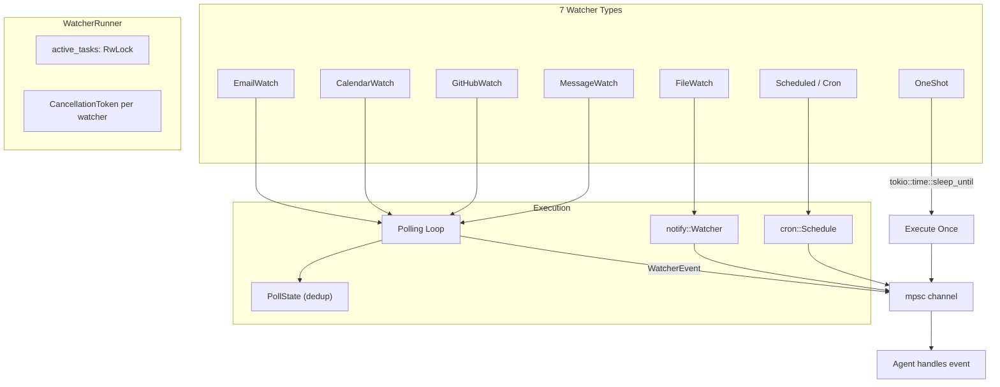

Watchers run as independent tokio tasks managed by `WatcherRunner`. Each has a `CancellationToken` for graceful shutdown. Polling watchers use `PollState` with `HashSet<u64>` for deduplication across cycles.

## Channel Adapters

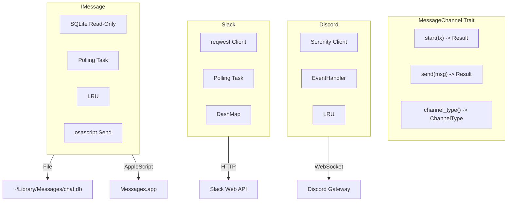

| Channel | Connection | Receive | Send | Reply Tracking |
|---------|-----------|---------|------|----------------|
| Discord | WebSocket via Serenity | EventHandler callback | HTTP via `channel_id.say()` | LRU cache (1000 entries) |
| Slack | HTTP polling (configurable interval) | `conversations.history` | `chat.postMessage` | DashMap user->channel |
| iMessage | SQLite polling of chat.db | Read-only query by ROWID | AppleScript `send` command | LRU cache (1000 entries) |

## Sub-Agent Orchestrator

The `delegate_tasks` tool enables Meepo to break complex requests into focused sub-tasks. Each sub-task runs as an independent agent with a scoped subset of tools.

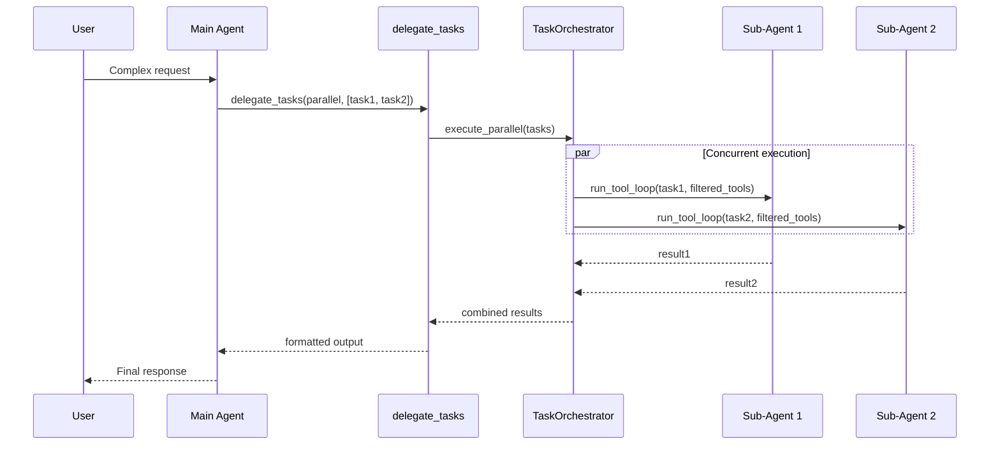

**Two execution modes:**

| Mode | Behavior | Use Case |
|------|----------|----------|
| `parallel` | Blocks until all sub-tasks complete, returns combined results | Multi-part research, data gathering |
| `background` | Fire-and-forget, reports progress asynchronously | Long-running work the user checks on later |

**Key design decisions:**
- **`FilteredToolExecutor`** wraps `ToolRegistry` to give each sub-agent a scoped tool list — `delegate_tasks` is always stripped to prevent recursive nesting
- **`OnceLock`** pattern resolves circular dependency: the tool needs a registry reference, but the registry contains the tool
- **`Semaphore`** enforces `max_concurrent_subtasks` to prevent resource exhaustion
- **Atomic CAS loop** for background group counting under contention

## Web Search

Web search is powered by the Tavily API with graceful degradation — everything works without a Tavily key, just without `web_search` and with raw HTML fallback for `browse_url`.

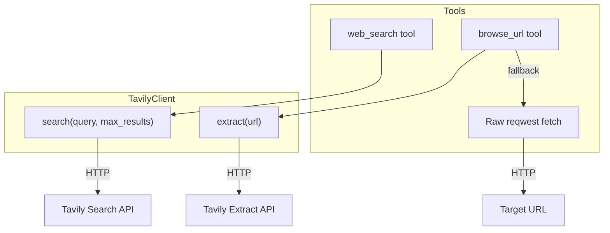

**Registration logic:** At startup, if `TAVILY_API_KEY` is set, a shared `TavilyClient` is created. `web_search` is registered only when the client exists. `browse_url` is always registered — it tries Tavily Extract first and falls back to raw fetch.

## Security Model

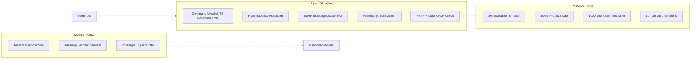

## Autonomous Loop

The `AutonomousLoop` replaces the simple reactive message handler with a continuous tick-based observe/think/act cycle. User messages are just one input among many — the agent also processes watcher events, evaluates goals, and takes proactive actions.

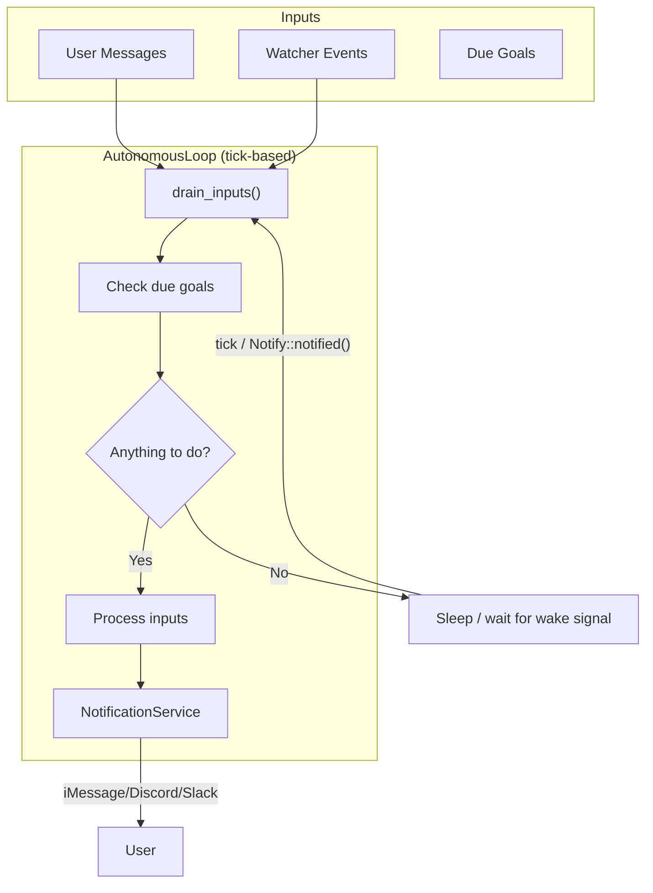

The loop uses `tokio::select!` across three sources: a cancellation token, a tick timer (`tick_interval_secs`), and a `Notify` wake signal (fired when new messages arrive for immediate processing). The `NotificationService` sends proactive alerts to the user's preferred channel with quiet hours support.

## Platform Abstraction

All OS-specific functionality is behind trait interfaces in `meepo-core::platform`. Each trait has macOS (AppleScript) and Windows (PowerShell/COM) implementations, selected at compile time via `#[cfg(target_os)]`.

| Trait | macOS Implementation | Windows Implementation |
|-------|---------------------|----------------------|
| `EmailProvider` | Mail.app via AppleScript | Outlook via PowerShell COM |
| `CalendarProvider` | Calendar.app via AppleScript | Outlook via PowerShell COM |
| `ClipboardProvider` | `arboard` crate | `arboard` crate |
| `AppLauncher` | `open -a` command | `open` crate |
| `UiAutomation` | System Events AppleScript | System.Windows.Automation |
| `BrowserProvider` | Safari/Chrome AppleScript | Not yet available |
| `RemindersProvider` | Reminders.app AppleScript | macOS only |
| `NotesProvider` | Notes.app AppleScript | macOS only |
| `NotificationProvider` | `osascript` display notification | macOS only |
| `ScreenCaptureProvider` | `screencapture` CLI | macOS only |
| `MusicProvider` | Apple Music AppleScript | macOS only |
| `ContactsProvider` | Contacts.app AppleScript | macOS only |

Factory functions (`create_email_provider()`, etc.) return `Box<dyn Trait>` for the current platform.

## MCP (Model Context Protocol)

The `meepo-mcp` crate provides both server and client functionality:

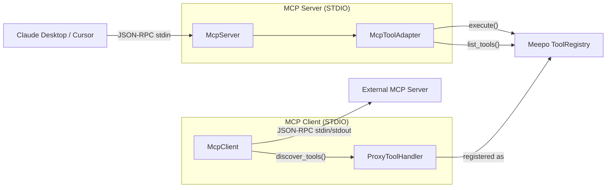

- **Server:** `meepo mcp-server` runs over STDIO. The `McpToolAdapter` wraps `ToolRegistry`, filtering out `delegate_tasks` (denylist). Handles `tools/list`, `tools/call`, and `initialize` JSON-RPC methods.
- **Client:** Spawns external MCP servers as child processes, discovers their tools via `tools/list`, and wraps each as a `ProxyToolHandler` registered in Meepo's `ToolRegistry` with namespaced names (`servername:toolname`).

## A2A (Agent-to-Agent)

The `meepo-a2a` crate implements Google's Agent-to-Agent protocol for multi-agent task delegation over HTTP.

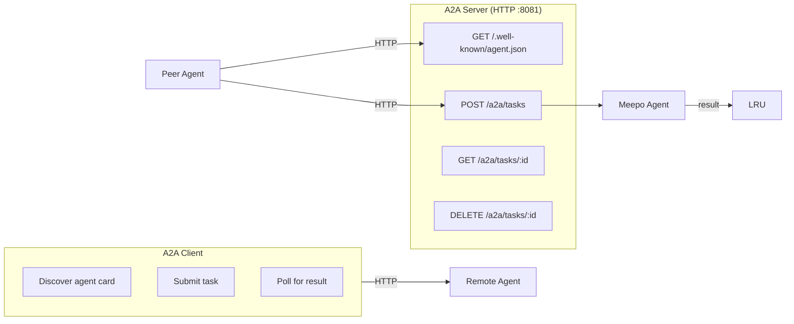

- **Server:** Listens on `127.0.0.1:{port}`, authenticates via Bearer token (constant-time comparison), enforces 1MB request body limit and 100 concurrent task cap. Tasks execute asynchronously via `Agent::handle_message` and results are stored in an LRU cache (1000 entries).
- **Client:** Discovers peer agents via `/.well-known/agent.json`, submits tasks, and polls for results. The `DelegateToAgentTool` exposes this as a tool the agent can use.

## Skills System

Skills are OpenClaw-compatible SKILL.md files that extend Meepo with additional tools at runtime.

```
~/.meepo/skills/
├── my_skill/
│   └── SKILL.md          # YAML frontmatter + markdown instructions
├── another_skill/
│   └── SKILL.md
```

Each SKILL.md has YAML frontmatter defining `name`, `description`, and optional `inputs`. The `SkillToolHandler` wraps each parsed skill as a `ToolHandler` and registers it in the `ToolRegistry` at startup. Invalid skills are skipped with a warning.

## Setup Wizard

The `meepo setup` command (`cmd_setup()` in `meepo-cli`) provides a comprehensive interactive wizard that walks users through the entire first-time setup process. On macOS it runs 7 steps; on other platforms, 5.

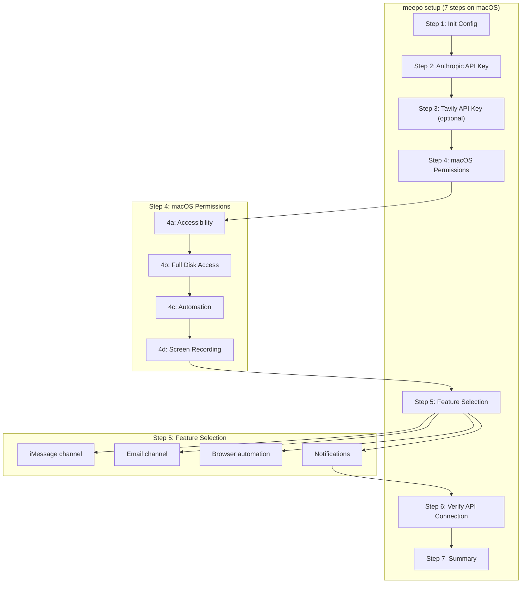

**Key implementation details:**

- **Terminal detection** — `detect_terminal_app()` reads `TERM_PROGRAM` env var to identify the user's terminal (iTerm, Warp, Ghostty, VS Code, Windsurf, Cursor, etc.) and uses the display name in permission instructions
- **Permission detection** — `check_accessibility()` tests via `osascript` System Events command; `check_full_disk_access()` tries opening `~/Library/Messages/chat.db`
- **System Settings deep links** — Opens the exact Privacy & Security pane via `open x-apple.systempreferences:com.apple.preference.security?Privacy_Accessibility` (and `Privacy_AllFiles`, `Privacy_Automation`, `Privacy_ScreenCapture`)
- **Config editing** — `update_config_value()` and `update_config_array()` perform in-place TOML edits (find section header, replace matching key line) so the setup wizard can enable features without requiring the user to manually edit config
- **Skip support** — Each permission step allows pressing 's' to skip, with a warning about which tools won't work
- **Platform gating** — macOS permission steps and macOS-only features (iMessage, email channel, browser) are behind `#[cfg(target_os = "macos")]`

## Template System

Agent templates allow swapping personalities, goals, and config overlays. A template is a `template.toml` file with metadata, goals, and a TOML config overlay.

| Command | Description |
|---------|-------------|
| `meepo template list` | List built-in and installed templates |
| `meepo template use <name>` | Activate a template (merges config overlay) |
| `meepo template info <name>` | Preview what a template changes |
| `meepo template reset` | Remove active template, restore previous config |
| `meepo template create <name>` | Create template from current config |

Templates can define goals that the autonomous loop evaluates on each tick, and can override any config section (agent model, channel settings, etc.).
